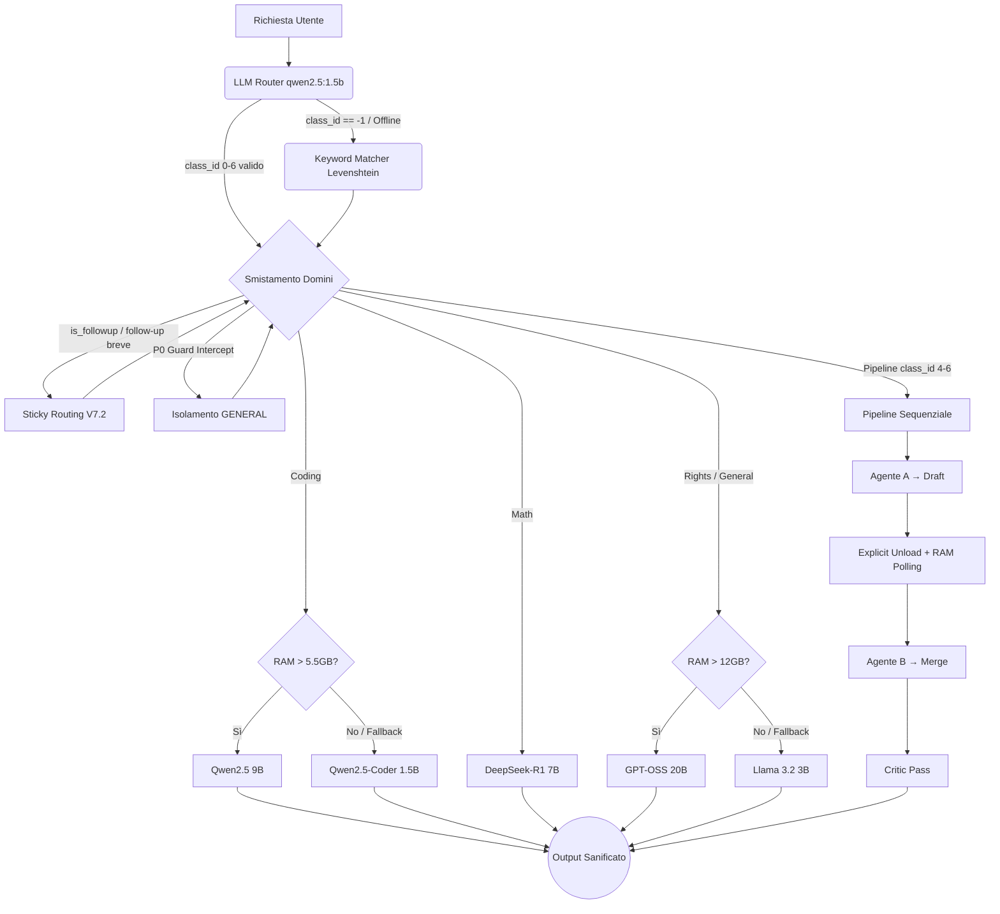

# 🧠 CYA N (Choose Your AI - Noob)

[]()
[]()
[]()
[]()
[]()

**CYA N** è un orchestratore intelligente per Large Language Models (LLM) progettato per funzionare interamente in locale. Agisce come un **dispatcher semantico**: analizza ogni richiesta tramite un micro-LLM classificatore, smistando automaticamente l'input verso l'agente IA più qualificato o orchestrando una collaborazione tra più agenti per query complesse.

Progettato con un focus estremo sull'ottimizzazione delle risorse, CYA N traccia archi operativi fluidi anche su macchine consumer con soli **8 GB di RAM**, grazie a un sistema di controllo dinamico della memoria, scaricamento esplicito del router e sincronizzazione hardware.

---

## ✨ Funzionalità Principali e Architettura V7.1.0

- 🔀 **LLM Router (Fase 0):** Il cuore del sistema è `llm_router.py`, che invoca `qwen2.5:1.5b` come classificatore semantico dedicato (temperatura 0, deterministico). Restituisce dominio, confidence scores per i 4 domini base, difficulty (1–3) e flag `is_followup`. Supporta 7 etichette di output: 4 mono-dominio + 3 pipeline (math→coding, rights→coding, rights→math).
- 🔁 **Score-Based Pipeline Promotion:** Anche se il router classifica una query come mono-dominio, il sistema può promuoverla a pipeline se gli score interni indicano un secondo dominio tecnico rilevante (`pipeline_score_min`) e la difficoltà rilevata è ≥ 2.
- 🔑 **Keyword Fallback (Fase 1 e 2):** In caso di indisponibilità del router LLM (`class_id == -1`), interviene `dispatcher_request.py` con un matcher in due fasi: *Hard-Match* rigoroso O(1) tramite set + regex, e *Soft-Match* basato sulla Distanza di Levenshtein con tolleranza dinamica.
- 📌 **Domain Retention V7.2 (Sticky Routing — LLM-first):** Le query brevi di follow-up vengono ancorate all'ultimo dominio attivo. La logica è a 3 step: **(1)** Override se il router rileva un dominio tecnico diverso con alta confidenza; **(2)** Sticky se `is_followup=true` dal router LLM; **(3)** Pipeline follow-up Python-side per contesti non visibili al LLM.
- 💬 **Chat History (Sliding Window):** Dialoghi multi-turno tramite finestra scorrevole (`max_history_turns`, default 5). Isolamento automatico della history su domain switch per evitare contaminazione cross-dominio.
- 🛡️ **GENERAL Isolation (P0 Guard):** Impedisce al dominio generalista di inquinare le pipeline tecniche (Semantic Bleed). Se `GENERAL` appare in una coppia ibrida, la pipeline viene abortita e degradata al dominio tecnico dominante.
- 🧠 **Pipeline Multi-Agente (Draft & Merge):** Se la query richiede due domini, CYA N esegue i modelli in sequenza. L'Agente A genera una bozza tecnica; l'Agente B integra con la sua specializzazione secondo la `pipeline_order_matrix`. Il router viene scaricato (unload) prima dell'attivazione degli agenti per liberare RAM.
- 🔎 **Critic Pass (Auto-Revisione):** L'Agente B esegue un passaggio finale di autovalutazione antagonistica, confrontando la propria sintesi con la query originale. La Chat History è esclusa in questa fase per garantire oggettività.
- ⏱️ **Explicit Unload + Active Polling (RAM):** Prima di caricare ogni modello, il sistema interroga l'hardware (`psutil`) per un eventuale downgrade preventivo. Il router viene scaricato esplicitamente dopo la classificazione. Durante le pipeline, `explicit_unload()` forza il rilascio immediato dell'Agente A, poi il polling attivo attende la disponibilità di RAM prima di avviare l'Agente B.
- 🧹 **Sanificazione Code-Block Aware:** Intercettazione dei tag di ragionamento (letti dinamicamente da `config`), traduzione matematica (LaTeX → Unicode) e filtri CJK applicati **esclusivamente sul testo discorsivo**, proteggendo i blocchi di codice Markdown.

---

## 🏗️ Topologia del Sistema e Archi di Instradamento



---

## 🗂️ Struttura del Progetto

```
CYA-N/
├── code/
│   ├── main.py                  # Entry point V7.1.0 — orchestrazione e routing loop
│   ├── llm_router.py            # Router semantico LLM (qwen2.5:1.5b) — Fase 0
│   ├── neural_classifier.py     # Classificatore neurale MLP (in sviluppo)
│   ├── ai_engine.py             # Motore di inferenza, BaseAI, explicit_unload
│   ├── config.py                # Configurazione centralizzata
│   ├── dispatcher_request.py    # Fallback keyword Hard/Soft Match
│   ├── prompts_templates.py     # System prompt e template pipeline
│   ├── helper.py                # Sanificazione output, spinner, LaTeX→Unicode
│   ├── db_query.py              # Dataset di training (INTENT_SENTENCES, BRIDGE_SENTENCES)
│   ├── build_dataset.py         # Generatore dataset per neural classifier
│   └── 1_prossimi_step.md       # Issue tracker e roadmap
├── keywords/
│   ├── coding.txt
│   ├── math.txt
│   └── rights.txt
├── CYA_N.pdf                    # Documentazione tecnica architetturale
├── QUERY_TESTED.md              # Log query di test e risultati
└── README.md
```

---

## ⚙️ Installazione e Avvio

### Prerequisiti

- Python 3.8+
- [Ollama](https://ollama.com/) installato e in esecuzione

### 1. Dipendenze Python

```bash
pip install psutil ollama sentence-transformers
```

> **Nota:** `psutil` è una dipendenza critica. Senza di essa il sistema non può monitorare la RAM a runtime, disabilitando downgrade preventivi, Active Polling e Explicit Unload. `sentence-transformers` è necessario per il futuro classificatore neurale.

### 2. Download dei Modelli Ollama

```bash
# Router semantico (dipendenza critica)
ollama pull qwen2.5:1.5b

# Dominio Coding
ollama pull qwen2.5:9b
ollama pull qwen2.5-coder:1.5b   # fallback

# Dominio Math
ollama pull deepseek-r1:7b

# Domini Rights e General
ollama pull gpt-oss:20b
ollama pull llama3.2:3b           # fallback
```

> **Build di sviluppo (8 GB RAM):** `config.py` imposta `qwen2.5-coder:1.5b` per tutti i domini. Pull obbligatorio: `qwen2.5:1.5b` (router) + `qwen2.5-coder:1.5b` (agenti).

### 3. Avvio

```bash
python code/main.py
```

---

## 🧩 Domìni Supportati

| Dominio          | Modello Primario   | Fallback               | Temperatura |
| ---------------- | ------------------ | ---------------------- | ----------- |
| Coding           | `qwen2.5:9b`     | `qwen2.5-coder:1.5b` | 0.5         |
| Math             | `deepseek-r1:7b` | —                     | 0.2         |
| Rights           | `gpt-oss:20b`    | `llama3.2:3b`        | 0.4         |
| General          | `gpt-oss:20b`    | `llama3.2:3b`        | 0.7         |
| **Router** | `qwen2.5:1.5b`   | keyword fallback       | 0.0         |

### Pipeline Supportate

| class_id | Pipeline       | Ordine Esecuzione                |
| -------- | -------------- | -------------------------------- |
| 4        | math→coding   | Math (Draft) → Coding (Merge)   |
| 5        | rights→coding | Rights (Draft) → Coding (Merge) |
| 6        | rights→math   | Rights (Draft) → Math (Merge)   |

---

## 🛠️ Comandi Speciali

| Comando                   | Effetto                                    |
| ------------------------- | ------------------------------------------ |
| `/reset`, `/clear`    | Azzera chat history e stato Sticky Routing |
| `exit`, `quit`, `q` | Chiude la sessione                         |

---

## 🗺️ Roadmap

- [ ] **Neural Classifier:** Drop-in replacement di `llm_router.py` basato su MLP frozen encoder (`paraphrase-multilingual-MiniLM-L12-v2`, 384-dim). Testa dominio (Sigmoid, 4 output multi-label) + testa difficoltà (Softmax, 3 classi). Training locale ~2–4 min su CPU, pesi ~700 KB.
- [ ] **Dataset Construction:** ~1800–2200 esempi pesati verso casi difficili (query corte/ambigue, keyword fuorvianti, pipeline implicite, follow-up senza contesto).
- [ ] **is_followup Head V2:** Terza testa neurale per la classificazione del follow-up all'interno del neural classifier.

---

## 📄 Documentazione

La documentazione tecnica architetturale completa è disponibile in `CYA_N.pdf`.
