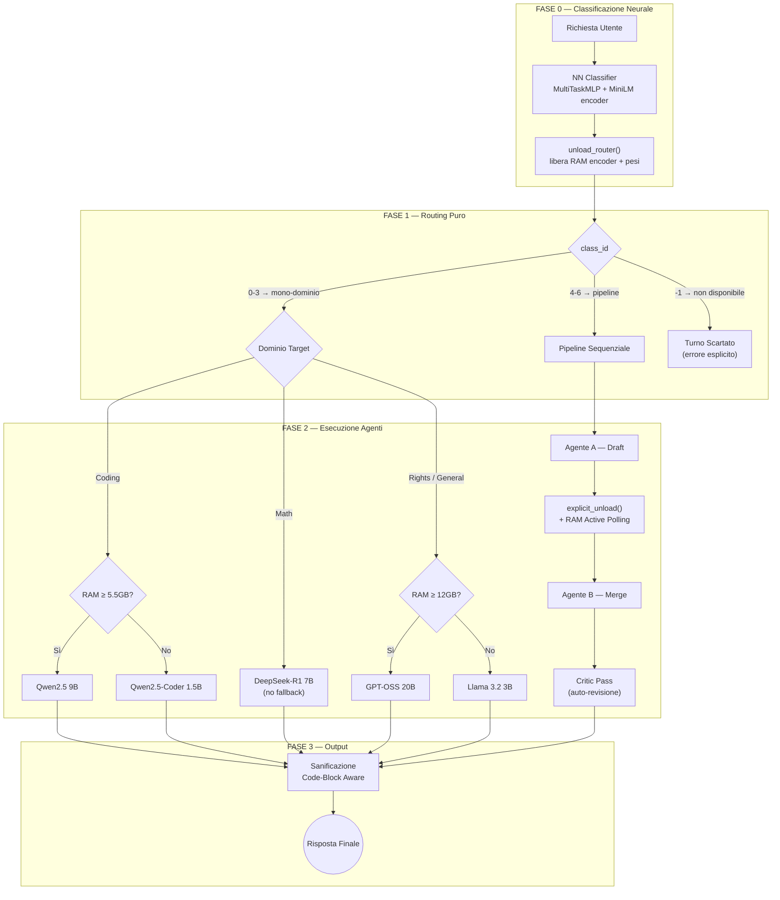

# 🧠 CYA N (Choose Your AI - Noob)

[]()
[]()
[]()
[]()
[]()
[]()

**CYA N** è un orchestratore intelligente per Large Language Models (LLM) progettato per funzionare interamente in locale. Agisce come un **dispatcher semantico**: analizza ogni richiesta tramite un classificatore neurale leggero addestrato, smistando automaticamente l'input verso l'agente IA più qualificato (secondo i benchmark rilasciati) o gestendo una collaborazione tra più agenti per query complesse.

Progettato con un focus estremo sull'ottimizzazione delle risorse, CYA N è adatto anche per macchine con soli **8 GB di RAM** (dove è stato testato il progetto), grazie a un sistema di controllo dinamico della memoria, scaricamento esplicito dei modelli quando necessario e sincronizzazione hardware.

---

## ✨ Funzionalità Principali e Architettura V7.4.0

- 🧬 **NN Classifier — MultiTaskMLP (Fase 0):** Il cuore del sistema è `nn_classifier.py`, un Multi-Layer Perceptron (~145K parametri) addestrato su embedding di `paraphrase-multilingual-MiniLM-L12-v2` (384-dim). Tre teste specializzate condividono un backbone comune: **domain** (multi-label, 4 output), **difficulty** (1–3) e **is\_followup** (binaria). Inferenza in **meno di 20 ms** e **meno di 100 MB di RAM**, contro i 300–800 ms e ~1.5 GB del precedente router LLM.
- 🎯 **Routing Purity:** Il `class_id` prodotto dal classificatore è **l'unica fonte di verità** per l'instradamento. Non esistono euristiche Python  che lo alterino: niente sticky routing testuale, niente promozione score-based, niente filtri di lunghezza della query. `domain_scores`, `difficulty` e `is_followup` restano puramente diagnostici (log di sessione).
- 🔀 **Instradamento a Due Stadi:** `_derive_class_id()` seleziona i domini tecnici candidati con una soglia permissiva (`threshold_mono = 0.50`) e conferma una pipeline solo se **entrambi** i domini superano una soglia severa (`threshold_pipeline = 0.75`). Il dominio `general` è escluso per costruzione dalle pipeline: nessuna guardia esterna è più necessaria.
- 💬 **Chat History (Sliding Window):** Dialoghi multi-turno tramite finestra scorrevole (`max_history_turns`, default 5). La profondità usata dal classificatore (`HISTORY_MAX_TURNS = 2`, in `history_utils.py`) è indipendente da quella dei modelli generativi.
- 🧩 **Isolamento del Contesto su Domain Switch:** Quando il dominio cambia rispetto all'ultimo turno, la history viene passata vuota all'agente corrente per evitare contaminazione cross-dominio. Questo meccanismo **non altera mai il routing**: agisce solo sul contesto conversazionale.
- 🧠 **Pipeline Multi-Agente (Draft & Merge):** Per le query ibride (`class_id` 4–6), CYA N esegue i modelli in sequenza. L'Agente A genera una bozza tecnica; l'Agente B la integra con la propria specializzazione. L'ordine è codificato direttamente nel `class_id`, senza matrici di configurazione esterne.
- 🔎 **Critic Pass (Auto-Revisione):** L'Agente B esegue un passaggio finale di autovalutazione antagonistica, confrontando la propria sintesi con la query originale. La Chat History è esclusa in questa fase per garantire oggettività.
- ⏱️ **Explicit Unload + Active Polling (RAM):** Il classificatore viene scaricato esplicitamente (`unload_router()`) subito dopo la classificazione, liberando l'encoder MiniLM prima di caricare qualsiasi agente generativo. Nelle pipeline, `explicit_unload()` forza il rilascio dell'Agente A; il polling attivo su `psutil` attende la RAM libera prima di avviare l'Agente B.
- 🧹 **Sanificazione Code-Block Aware:** Intercettazione dei tag di ragionamento (letti dinamicamente da `config`), traduzione matematica (LaTeX → Unicode) e filtri CJK applicati **esclusivamente sul testo discorsivo**, proteggendo i blocchi di codice Markdown.
- ⚠️ **Nessun Fallback Testuale:** Il vecchio dispatcher a parole chiave (`dispatcher_request.py`) è stato rimosso in quanto codice morto. Se il classificatore non è disponibile (pesi assenti), il turno viene scartato con un errore esplicito anziché degradare silenziosamente.

---

## 🏗️ Topologia del Sistema e Archi di Instradamento

Il flusso di elaborazione di ogni richiesta attraversa quattro fasi distinte, rispecchiando fedelmente la sequenza implementata in `main.py`:



---

## ⚙️ Installazione e Avvio

### Prerequisiti

- Python 3.8+
- [Ollama](https://ollama.com/) installato e in esecuzione
- Git LFS (per `classifier/nn_weights.pt` ed `embeddings_v2.pkl`)

### 1. Dipendenze Python

```bash
pip install psutil ollama sentence-transformers torch scikit-learn
```

> **Nota:** `psutil` è una dipendenza critica. Senza di essa il sistema non può monitorare la RAM a runtime, disabilitando downgrade preventivi, Active Polling ed Explicit Unload. `torch` e `sentence-transformers` sono necessari sia per l'addestramento sia per l'inferenza del classificatore; `scikit-learn` serve solo in fase di training (calcolo F1-score).

### 2. Download dei Modelli Generativi (Ollama)

```bash
# Dominio Coding
ollama pull qwen2.5:9b
ollama pull qwen2.5-coder:1.5b   # fallback

# Dominio Math
ollama pull deepseek-r1:7b

# Domini Rights e General
ollama pull gpt-oss:20b
ollama pull llama3.2:3b           # fallback
```

### 3. Classificatore Neurale

Se `code/classifier/nn_weights.pt` è già presente (es. scaricato via Git LFS), questo step si può saltare. In caso contrario, l'addestramento va eseguito dalla root del progetto seguendo la cascata completa — ogni script consuma l'output del precedente:

```bash
python code/build_dataset_v2.py        # genera dataset_v2.jsonl
python code/precompute_embeddings.py   # calcola embeddings_v2.pkl
python code/train_nn.py                # produce nn_weights.pt
python code/step4_evaluation.py        # opzionale — verifica qualità (smoke test)
```

### 4. Avvio

```bash
python code/main.py
```

---

## 🧩 Domìni Supportati

| Dominio | Modello Primario   | Fallback               | Temperatura |
| ------- | ------------------ | ---------------------- | ----------- |
| Coding  | `qwen2.5:9b`     | `qwen2.5-coder:1.5b` | 0.5         |
| Math    | `deepseek-r1:7b` | —                     | 0.2         |
| Rights  | `gpt-oss:20b`    | `llama3.2:3b`        | 0.4         |
| General | `gpt-oss:20b`    | `llama3.2:3b`        | 0.7         |

### Classificatore (Fase 0 — non appartiene alla flotta Ollama)

| Componente                         | Dettaglio                                                           |
| ---------------------------------- | ------------------------------------------------------------------- |
| Architettura                       | MultiTaskMLP, ~145K parametri                                       |
| Encoder (frozen)                   | `paraphrase-multilingual-MiniLM-L12-v2`, 384-dim, L2-normalizzato |
| Latenza                            | < 20 ms                                                             |
| Impronta RAM                       | < 100 MB                                                            |
| Accuratezza (smoke test, 59 query) | 91.5% assoluta · 93.2% di routing effettivo                        |

### Pipeline Supportate

| class_id | Pipeline         | Ordine Esecuzione                |
| -------- | ---------------- | -------------------------------- |
| 4        | math → coding   | Math (Draft) → Coding (Merge)   |
| 5        | rights → coding | Rights (Draft) → Coding (Merge) |
| 6        | rights → math   | Rights (Draft) → Math (Merge)   |

---

## 🛠️ Comandi Speciali

| Comando                             | Effetto                                                                                |
| ----------------------------------- | -------------------------------------------------------------------------------------- |
| `/reset`, `/clear`              | Azzera chat history e ultimo dominio attivo (usato solo per l'isolamento del contesto) |
| `exit`, `esci`, `quit`, `q` | Chiude la sessione                                                                     |

---

## 🗺️ Roadmap

**Completato**

- [X] **NN Classifier (MultiTaskMLP):** sostituisce integralmente `llm_router.py`. Il `class_id` è l'unica fonte di verità per il routing (*Routing Purity*).
- [X] **Cascata di Training:** `build_dataset_v2.py → precompute_embeddings.py → train_nn.py → step4_evaluation.py`, con split anti-leakage (70/15/15 prima dell'augmentation).
- [X] **is\_followup Head:** terza testa neurale integrata nel MultiTaskMLP, non più delegata a euristiche Python.

**In corso**

- [ ] **Prossimo milestone:** Step 1 di `1_prossimi_step.md` — criteri di attivazione della pipeline.
- [ ] **Dataset patching:** risoluzione del sotto-caso `coding` (history) + query corta/generica → `general`, responsabile dei 4 errori residui nello smoke test. Rimandato a dati di produzione reali.
- [ ] **Cleanup minore:** aggiornamento docstring in `nn_classifier.py` (soglie obsolete), rimozione variabile `ok_diff` inutilizzata in `step4_evaluation.py`, eliminazione del prototipo superato `script_NN_classifier.py`.

---

## 📄 Documentazione

La documentazione tecnica architetturale completa è disponibile in `CYA_N.pdf`.
